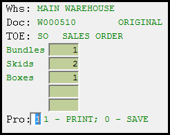

# Create Shipping Labels

Print shipping label(s) for individual sales orders (document number prefixed with “I”), branch transfers (document number prefixed with “T”) or Outside Processing orders (document number prefixed with “C”).

<figure><figcaption></figcaption></figure>

1. Scan or enter (or press F4 to select) the order/branch transfer Doc number (if entering manually, you can omit the letter or leading zeroes).
2. Type the number of each bundle type1 (this determines how many shipping tags will print).
3. Type “1” to print the tags or “0” to save for later.

Sample

.png>)

Configuration

1 [Warehouse Controls](https://4glsol.com/sm3-helpdocs/Content/Admin/Config/ADM_config_whs_controls_IN19.htm) \[IN19] > OE Options > Packaging Types

***
